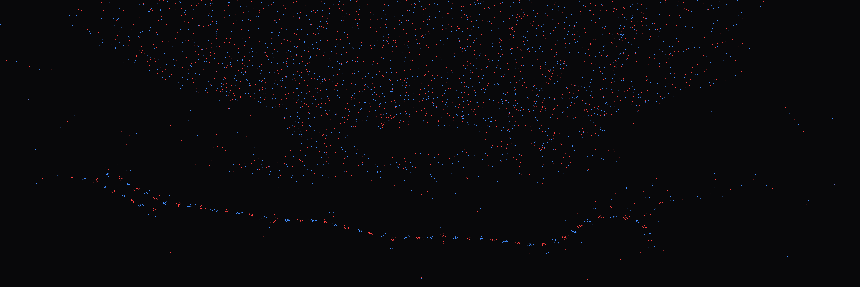

# GPU Two-Type Particles (Uniform Grid Neighbors)

Real-time GPU particle simulation built with **ModernGL + GLFW** where all physics runs in a **GLSL compute shader**.

## Demo


## Uniform grid structure


## Install
```bash
python -m venv .venv
# Windows:
.venv\Scripts\activate
# macOS/Linux:
source .venv/bin/activate

pip install -r requirements.txt
```

To run, run any .py from src/ folder.

## Benchmarking

python Particles_Test_CPU.py --bench --config bench_config.json

python Particles_in_pygame.py --bench --config bench_config.json

python plot_bench.py --cpu cpu_moderngl.csv --pygame cpu_pygame.csv --out bench.png
