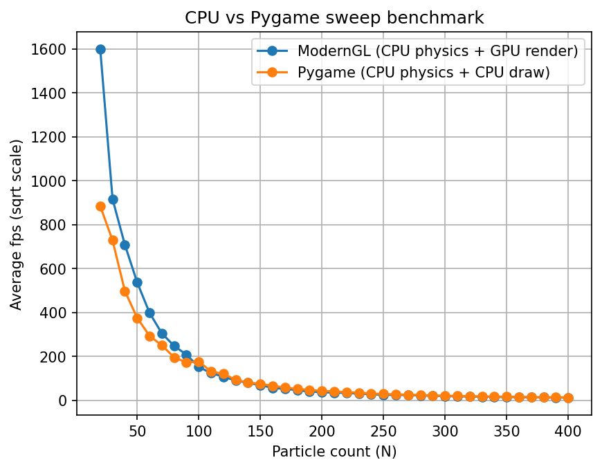

# GPU Two-Type Particles 
Real-time GPU particle simulation built with **ModernGL + GLFW** where all physics runs in a **GLSL compute shader**.
**Demo video:** https://www.youtube.com/watch?v=-8xZGHFHp90


## Benchmarking

```bash
python Particles_Test_CPU.py --bench --config bench_config.json
python Particles_in_pygame.py --bench --config bench_config.json
python plot_bench.py --cpu cpu_moderngl.csv --pygame cpu_pygame.csv --out bench.png
```



## Install
```bash
python -m venv .venv
# Windows:
.venv\Scripts\activate
# macOS/Linux:
source .venv/bin/activate

pip install -r requirements.txt
```

assets/   → images, GIFs, benchmarks  

docs/     → notes  

premade/  → visual experiments with premade configurations

src/      → CPU/GPU comparison & benchmarks  
            Particles_Test_GPU will run the simulator physics via compute shader leading to great preformance
            Particles_Test_CPU and Particles_in_pygame will run physics via the CPU and will preform poorly
            Run plot_bench.py after doing benchmarking steps

## Core Rules

- Particles have types  
- Same type → repel  
- Different type → attract  
- Simple local rules → complex global behavior  

As particle count increases, structures like clusters, lattices, flows, and rigid formations emerge.


