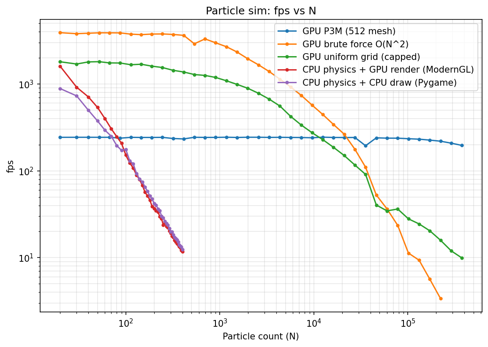

# GPU Two-Type Particles 
Real-time GPU particle simulation built with **ModernGL + GLFW** where all physics runs in a **GLSL compute shader**.
**Demo video:** https://www.youtube.com/watch?v=-8xZGHFHp90


## Benchmarking

Every engine takes `--bench` and sweeps N until a frame crosses `abort_ms`, so
the fast and slow engines share one config:

```bash
cd src
python Particles_Test_GPU_p3m.py       --bench --config bench_config_gpu.json --out gpu_p3m.csv --mesh-res 512
python Particles_Test_GPU_bruteforce.py --bench --config bench_config_gpu.json --out gpu_bruteforce.csv
python Particles_Test_GPU_grid.py       --bench --config bench_config_gpu.json --out gpu_grid.csv
python Particles_Test_CPU.py            --bench --config bench_config.json     --out cpu_moderngl.csv
python Particles_in_pygame.py           --bench --config bench_config.json     --out cpu_pygame.csv

python plot_bench.py --y fps --logx --logy --out ../assets/bench_gpu_vs_cpu.png \
  --csv "GPU P3M (512 mesh)=gpu_p3m.csv" \
  --csv "GPU brute force O(N^2)=gpu_bruteforce.csv" \
  --csv "GPU uniform grid (capped)=gpu_grid.csv" \
  --csv "CPU physics + GPU render (ModernGL)=cpu_moderngl.csv" \
  --csv "CPU physics + CPU draw (Pygame)=cpu_pygame.csv"
```

`compute_ms` is a GL timer query around the GPU physics passes only. `frame_ms` is the whole
frame including swap. `--bench` turns vsync off so you measure the GPU and not your
monitor.

Full benchmark sweep (all measured particle counts and all five engines):



Run on an RTX 5060, driver 591.59, GL 4.3, 900x700 window. Both axes are log.

| Engine | fps at N=400 | N at 60 fps | Largest N measured |
|---|---|---|---|
| GPU, P3M 512 mesh | ~233 | >377,000 | 377,059 @ 196 fps |
| GPU, brute force O(N²) | 3621 | ~44,000 | 223,113 @ 3.4 fps |
| GPU, uniform grid (capped) | 1380 | ~42,100 | 377,059 @ 9.9 fps |
| CPU physics + GPU render | 11.7 | ~157 | 400 @ 11.7 fps |
| CPU physics + CPU draw (Pygame) | 12.5 | ~167 | 400 @ 12.5 fps |

The brute-force and grid lines are flat on the left because the GPU is mostly
measuring launch overhead. P3M starts near 243 fps because every frame performs
three fixed-size FFTs; unlike the other engines, its cost then barely changes as
particles are added.

At N=400, which is about all the CPU version can handle, brute force on the GPU
runs 309x faster. At the other end, P3M holds 377,000 particles at 196 fps while
the capped grid manages 10 fps.

The brute force kernel does roughly 170 billion pair interactions per second. At
N=223,113 that is 5x10^10 pairs in 267 ms.

Two things here I did not expect going in.

The grid does not beat brute force until about 78,000 particles. Below that the
naive all pairs loop is faster, because every thread in a warp reads the same
particle j and the L1 broadcasts it for free. The grid pays for scattered cell
lookups and a linked list walk where every load waits on the one before it.
`GRID_RES` is 256 while `NEIGHBOR_RADIUS` is 0.18, so each particle scans
49x49 = 2401 cells and nearly all of them are empty. Sizing cells to the radius
is the fix.

Past about 46,000 the grid curve flattens partly because it stops doing all the
work. `MAX_NEIGHBORS` is 2056 and it starts cutting the neighbor list short. You
can see it as a dip in the data: N=78,119 finishes in 26.1 ms while N=60,092
takes 28.3 ms, so 30% more particles ran faster. Brute force computes every pair
the whole way, so its curve is honest N².

## P3M: Speed vs Accuracy

`Particles_Test_GPU_p3m.py` preserves the full all-pairs force law. It places
the two particle types on a mesh as positive/negative density, evaluates the
smooth far field with GPU FFTs, and directly corrects extremely close pairs.
It also uses separate input/output particle buffers, so a time step never reads
positions another GPU thread is currently changing. Mesh deposition currently
uses NVIDIA's `GL_NV_shader_atomic_float` extension (available on the tested RTX 5060).

The error benchmark gives every solver the **same frozen snapshot**. At small N,
a float64 CPU all-pairs calculation is the truth source; the race-free GPU brute
solver and P3M are compared against it. The numbers below were rerun on August 4,
2026 using the same RTX 5060 as the full benchmark graph.

```bash
cd src
python bench_p3m_accuracy.py --mesh-res 256 512 --out-dir .
```

Force accuracy at N=4,096 (particles initially concentrated in the center):

| Solver | Compute | RMS force error | 95th-percentile error¹ |
|---|---:|---:|---:|
| GPU brute force, float32 | 0.543 ms | 0.00012% | 0.00023% |
| P3M, 256² mesh | 0.916 ms | 0.379% | 0.669% |
| **P3M, 512² mesh** | **3.619 ms** | **0.0967%** | **0.170%** |

The FFT has a fixed cost, so P3M is slower at small N and rapidly wins as the
all-pairs solver grows quadratically:

| N | Brute force | P3M 512² | Speedup |
|---:|---:|---:|---:|
| 20,000 | 2.86 ms | 3.64 ms | 0.8x |
| 50,000 | 18.17 ms | 3.70 ms | 4.9x |
| 100,000 | 62.60 ms | 3.63 ms | 17.2x |
| 200,000 | 234.31 ms | 3.73 ms | 62.9x |

Particle-by-particle trajectories eventually separate because this system is
chaotic. Starting both solvers from the same 2,048 particles, the 512² mesh had
0.11% of world-width position RMSE after 30 steps, 1.97% after 100, and 4.34%
after 300. A coarse 32×32 occupancy comparison was 1.12%, 25.1%, and 31.4% at
those checkpoints. This separates “the exact same particle trajectory” from
“the same large-scale visual distribution.” Raw results are in
`p3m_accuracy.csv`, `p3m_speed.csv`, and `p3m_drift.csv`.

¹ Error magnitude divided by the reference RMS force magnitude.

## Install
```bash
python -m venv .venv
# Windows:
.venv\Scripts\activate
# macOS/Linux:
source .venv/bin/activate

pip install -r requirements.txt
```

## Where to Start
Start with src/Particles_Test_GPU_p3m.py for the fast accuracy-oriented version, or
src/Particles_Test_GPU_grid.py for the cutoff-based visual experiment. Press spacebar to add particles. Particles added per spacebar
press, forces, drag, and starting particle count are all constants at the top of the respective .py file
(ex. at the top of Particles_Test_GPU_grid.py)

assets/   → images, GIFs, benchmarks  

docs/     → notes  

premade/  → visual experiments with premade configurations

src/      → CPU/GPU sims (press spacebar to add particles while running)

```
Particles_Test_GPU_p3m        → full force law via GPU mesh FFT + direct near correction
Particles_Test_GPU_grid       → neighbor-limited linked grid with a safety cap
Particles_Test_GPU_bruteforce → every pair; reference behavior, O(N²)
Particles_Test_CPU            → physics on the CPU, rendered with ModernGL
Particles_in_pygame           → physics on the CPU, drawn by Pygame
```

Every one of them takes `--bench` to sweep N and write a csv; `plot_bench.py` draws them together.

## Core Rules

- Particles have types  
- Same type → repel  
- Different type → attract  
- Simple local rules → complex global behavior  

As particle count increases, structures like clusters, lattices, flows, and rigid formations emerge.


